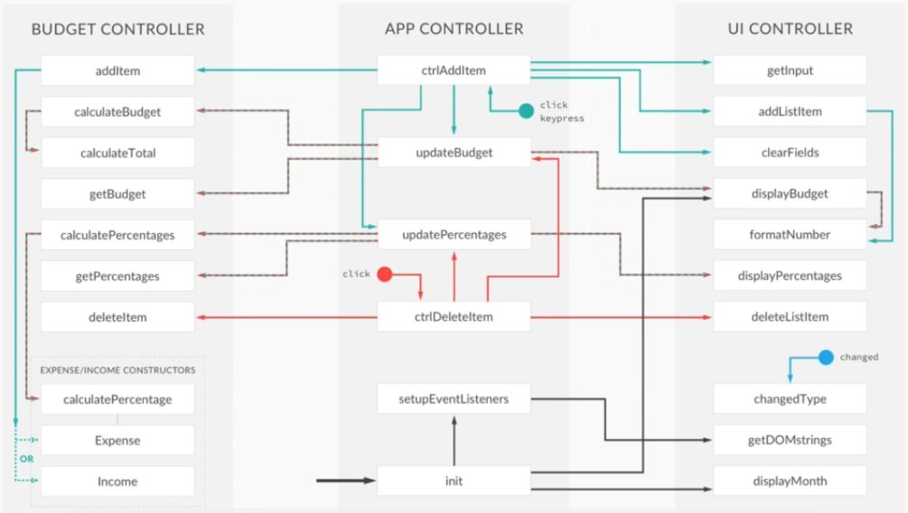
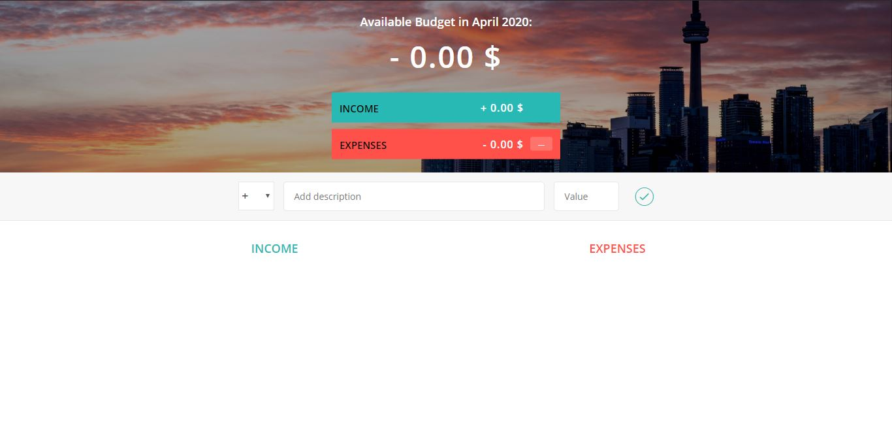
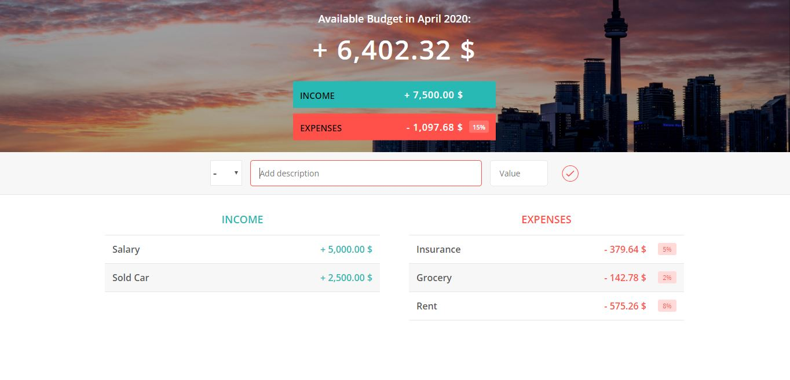

# budgety_JS
'Budgety' is a JavaScript-based web application developed using the fundamentals of HTML and CSS. The functionality of this application is: User can add their 'income' &amp; 'expenses' for the particular month and can see the remaining available budget and also view the total expenses in the form of a percentage.

Technology Used:
1.  JavaScript
2.  HTML
3.  CSS

Prefered Tool: Microsoft Visual Studio Code

Application Architecure:

Application Screenshot:

